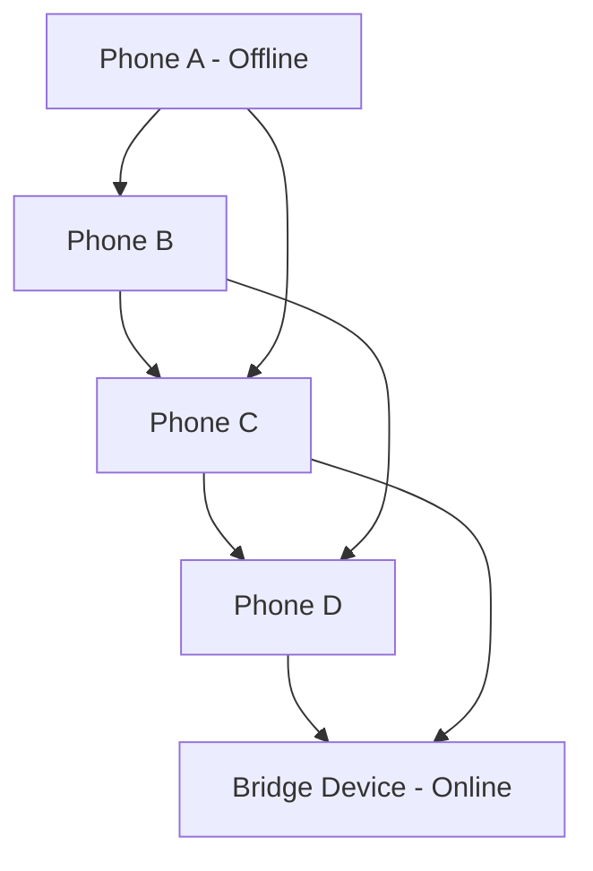

# UPI Offline Mesh — Deferred Settlement System


---

## Overview

UPI Offline Mesh is a Spring Boot backend system that simulates **offline UPI payments routed through a Bluetooth-style mesh network**.

A user can initiate a payment without internet. The transaction is encrypted, propagated across nearby devices, and eventually reaches a device with connectivity. That device uploads it to the backend, where the payment is securely processed.

The system demonstrates key distributed systems concepts:

* Offline-first transaction design
* Secure hybrid encryption
* Idempotent distributed ingestion
* Eventual consistency in payments
* Replay and tamper resistance

---

## System Architecture

### High-Level Flow

```mermaid
flowchart LR

A[Sender Device] --> B[Create PaymentInstruction]
B --> C[Encrypt using Hybrid Crypto]
C --> D[MeshPacket (TTL-based)]
D --> E[Bluetooth Mesh Network]
E --> F[Bridge Device with Internet]
F --> G[Backend /bridge/ingest API]

G --> H[SHA-256 Ciphertext Hash]
H --> I[Idempotency Check]
I -->|First Request| J[Decrypt Packet]
I -->|Duplicate| X[Drop Request]

J --> K[Validate Freshness]
K --> L[Settlement Service]

L --> M[(Account Table)]
L --> N[(Transaction Ledger)]
```

---

## Mesh Network Simulation



---

## Key Features

### 1. Offline Payment Creation

* Payment is created without internet connectivity
* Includes nonce + timestamp for uniqueness and replay protection

### 2. Hybrid Encryption

* RSA-OAEP encrypts AES key
* AES-256-GCM encrypts payload
* Ensures confidentiality and tamper detection

### 3. Mesh-Based Propagation

* Devices simulate Bluetooth gossip network
* TTL-based packet forwarding
* Multi-hop propagation across devices

### 4. Idempotent Backend Processing

* SHA-256 hash of ciphertext used as unique key
* `putIfAbsent` ensures exactly-once processing
* Prevents duplicate settlement from multiple bridge uploads

### 5. Secure Settlement Engine

* Atomic debit and credit operations
* Spring `@Transactional` ensures consistency
* `@Version` used for optimistic locking

---

## API Reference

### Core APIs

| Method | Endpoint            | Description          |
| ------ | ------------------- | -------------------- |
| GET    | `/api/server-key`   | Fetch RSA public key |
| GET    | `/api/accounts`     | List all accounts    |
| GET    | `/api/transactions` | Last 20 transactions |

---

### Simulation APIs

| Method | Endpoint           | Description              |
| ------ | ------------------ | ------------------------ |
| POST   | `/api/demo/send`   | Create and inject packet |
| POST   | `/api/mesh/gossip` | Run mesh propagation     |
| POST   | `/api/mesh/flush`  | Upload from bridge nodes |
| POST   | `/api/mesh/reset`  | Reset simulation state   |

---

### Production Endpoint

| Method | Endpoint             | Description                              |
| ------ | -------------------- | ---------------------------------------- |
| POST   | `/api/bridge/ingest` | Real ingestion endpoint for bridge nodes |

---

## Request Example

```http
POST /api/bridge/ingest
Content-Type: application/json
X-Bridge-Node-Id: phone-bridge-1
X-Hop-Count: 3
```

```json
{
  "packetId": "uuid",
  "ttl": 2,
  "createdAt": 1730000000000,
  "ciphertext": "base64-encoded-payload"
}
```

---

## Security Design

### Threats Addressed

* Duplicate packet delivery
* Replay attacks
* Ciphertext tampering
* Untrusted intermediate devices
* Concurrent ingestion conflicts

### Guarantees

* Exactly-once settlement
* Tamper detection via AES-GCM authentication
* Replay protection using timestamp validation
* Atomic ledger updates
* Idempotent ingestion pipeline

---

## Core Backend Pipeline

1. Compute SHA-256 hash of ciphertext
2. Idempotency check using atomic insert
3. Decrypt using RSA + AES-GCM
4. Validate timestamp freshness
5. Execute transactional settlement
6. Persist ledger entry

---

## Tech Stack

* Java 17+
* Spring Boot 3.x
* Spring Data JPA
* Hibernate ORM
* H2 Database (demo)
* AES-256-GCM encryption
* RSA-OAEP encryption
* Maven Wrapper

---

## Project Structure

```
model/        → Entities (Account, Transaction, MeshPacket)
crypto/       → Encryption + Key management
service/      → Business logic (mesh, settlement, ingestion)
controller/   → REST APIs
config/       → Scheduling + app configuration
```

---

## What This Project Demonstrates

This system models patterns used in:

* UPI-like payment systems
* Distributed transaction processing
* Offline-first financial systems
* Idempotent API design
* Secure message routing in untrusted networks

---

## Limitations (Important for Real Systems)

* Mesh network is simulated (no real BLE/WiFi Direct)
* No Redis (idempotency is in-memory)
* No production-grade key management (no HSM/KMS)
* No authentication layer for bridge nodes
* No real banking integration

---

## How to Run

```bash
./mvnw spring-boot:run
```

Then open:

```
http://localhost:8080
```

---

## Testing

```bash
./mvnw test
```

Key test:

* `IdempotencyConcurrencyTest` ensures exactly-once settlement under concurrent ingestion
