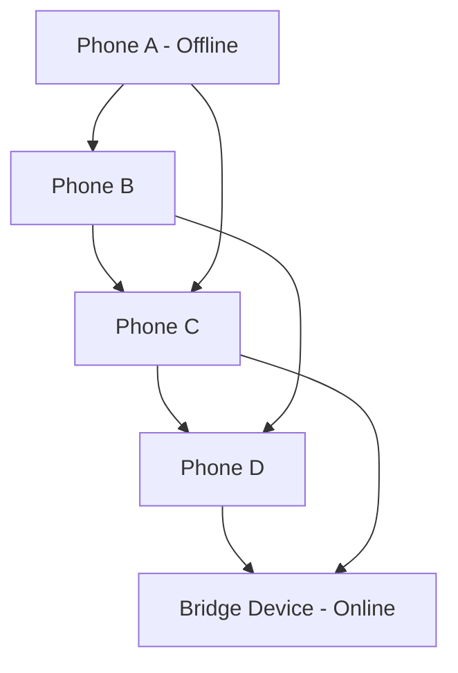

# UPI Offline Mesh — Deferred Settlement System


---

## Overview

UPI Offline Mesh is a Spring Boot–based backend system that simulates **offline-first UPI payments routed through a Bluetooth-style mesh network**, where transactions propagate device-to-device until one node regains internet connectivity and uploads them for settlement.

This project demonstrates how **deferred settlement systems, cryptographic security, idempotent processing, and distributed duplicate handling** work in real-world payment infrastructures.

---

## Core Idea

A payment is created offline, encrypted on a sender device, and propagated across a mesh of untrusted intermediate devices. Eventually, a bridge device with internet connectivity uploads it to the backend, where it is:

* Decrypted securely
* Deduplicated atomically
* Validated for freshness
* Persisted as a financial transaction

---

## System Capabilities

* Offline transaction creation and encryption (hybrid cryptography)
* Bluetooth-style mesh propagation simulation
* Packet routing with TTL-based gossip protocol
* Secure AES-GCM + RSA-OAEP hybrid encryption
* Idempotent transaction processing (zero double-spend in backend)
* Ledger settlement with transactional consistency
* Replay attack protection using timestamp + nonce
* Concurrent duplicate ingestion handling

---

## Architecture

### High-Level Flow

```mermaid
flowchart LR

A[Sender Device] --> B[MeshPacket Created]
B --> C[Encrypted Payload (RSA + AES-GCM)]
C --> D[Mesh Network Gossip]
D --> E[Bridge Node with Internet]
E --> F[Backend /api/bridge/ingest]

F --> G[SHA-256 Packet Hash]
G --> H[Idempotency Check (SET NX)]
H -->|First Seen| I[Decrypt Payload]
H -->|Duplicate| Z[Drop Request]

I --> J[Freshness Validation]
J --> K[Settlement Service]
K --> L[(Account DB)]
K --> M[(Transaction Ledger)]
```

---

## Mesh Simulation Model



---

## Key Design Components

### 1. Hybrid Encryption Layer

* RSA-OAEP encrypts AES key
* AES-GCM encrypts payload
* Ensures confidentiality + tamper detection

### 2. Idempotency Engine

* Uses SHA-256(ciphertext)
* `ConcurrentHashMap.putIfAbsent` simulates Redis SET NX
* Guarantees exactly-once settlement

### 3. Settlement Engine

* Spring `@Transactional` guarantees atomic debit/credit
* `@Version` enables optimistic locking
* Prevents race conditions on account balances

### 4. Mesh Gossip Layer

* Simulates Bluetooth propagation
* TTL-based forwarding
* Multi-device packet replication

---

## API Reference

### Public APIs

| Method | Endpoint            | Description          |
| ------ | ------------------- | -------------------- |
| GET    | `/api/server-key`   | Fetch public RSA key |
| GET    | `/api/accounts`     | List all accounts    |
| GET    | `/api/transactions` | Recent transactions  |

---

### Simulation APIs

| Method | Endpoint           | Description            |
| ------ | ------------------ | ---------------------- |
| POST   | `/api/demo/send`   | Create + inject packet |
| POST   | `/api/mesh/gossip` | Run mesh propagation   |
| POST   | `/api/mesh/flush`  | Bridge uploads packets |
| POST   | `/api/mesh/reset`  | Reset simulation       |

---

### Production Endpoint

| Method | Endpoint             | Description               |
| ------ | -------------------- | ------------------------- |
| POST   | `/api/bridge/ingest` | Bridge node ingestion API |

---

## Example Request

```http
POST /api/bridge/ingest
Content-Type: application/json
X-Bridge-Node-Id: phone-bridge-1
X-Hop-Count: 3
```

```json
{
  "packetId": "uuid",
  "ttl": 2,
  "createdAt": 1730000000000,
  "ciphertext": "base64..."
}
```

---

## Security Model

### Threats Addressed

* Packet replay attacks
* Duplicate delivery from multiple bridge nodes
* Ciphertext tampering
* Untrusted intermediaries
* Offline transaction corruption

### Guarantees

* Exactly-once settlement (idempotent ingestion)
* Tamper detection via AES-GCM authentication
* Replay protection via timestamp validation
* Atomic balance updates via transactional DB layer

---

## Tech Stack

* Java 17+
* Spring Boot 3.x
* Spring Data JPA
* Hibernate
* H2 Database (demo)
* Cryptography: RSA-OAEP, AES-256-GCM
* Concurrency: ConcurrentHashMap, parallel streams
* Maven Wrapper

---

## What Makes This Interesting

This project demonstrates patterns used in:

* Distributed payment systems (UPI, PayPal-style ledgers)
* Offline-first financial systems
* Eventual consistency models
* Idempotent API design
* Secure message routing in untrusted networks

---

## Limitations (Design Aware)

* No real BLE stack (simulated mesh only)
* No persistent Redis (in-memory idempotency)
* No real banking integration layer
* No hardware-backed key storage (HSM/KMS missing)
* No regulatory compliance layer

---

## Run Instructions

```bash
./mvnw spring-boot:run
```

Then open:

```
http://localhost:8080
```

---

## Testing

```bash
./mvnw test
```

Key test:

* `IdempotencyConcurrencyTest` ensures exactly-once settlement under concurrent ingestion

---

## Why This Project Matters

This system demonstrates how modern distributed payment systems handle:

* Offline-to-online transitions
* Duplicate network delivery
* Cryptographic integrity
* Idempotent financial operations
* Safe concurrent settlement

---

## License

Educational / Demonstration Use Only
